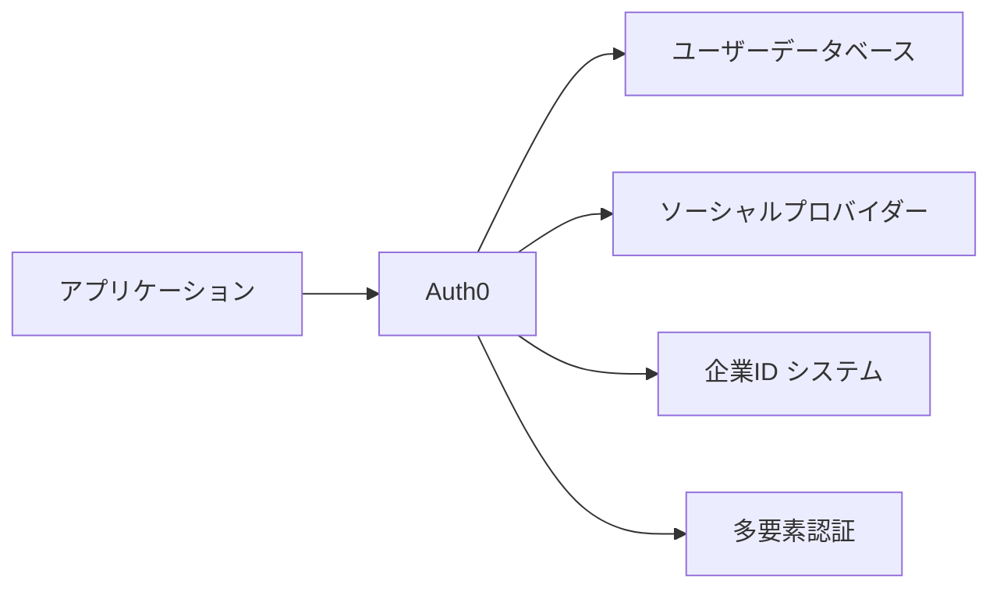
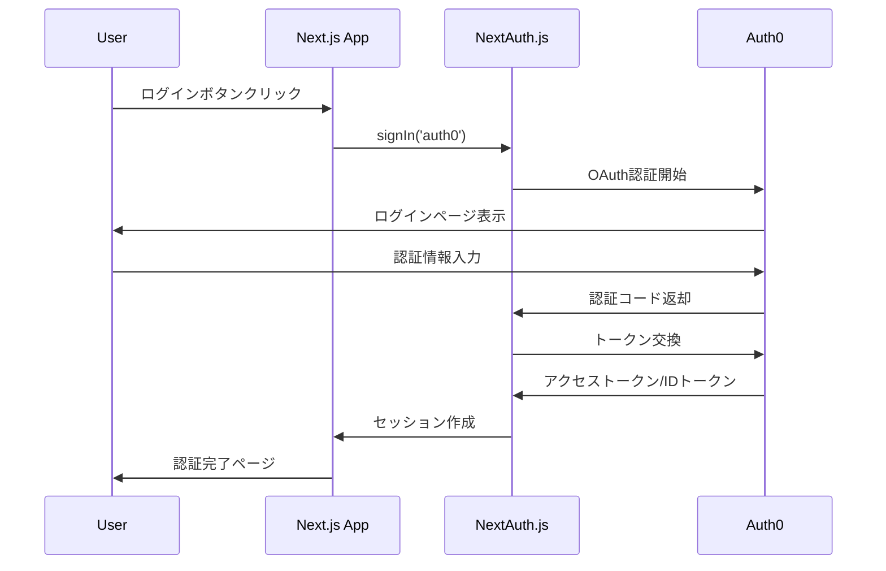

# Auth0 & NextAuth.js 詳細ガイド

このドキュメントでは、このプロジェクトで使用されているAuth0とNextAuth.jsの詳細な説明と実装方法について解説します。

## 📚 目次

1. [Auth0とは](#auth0とは)
2. [NextAuth.jsとは](#nextauthjsとは)
3. [なぜこの組み合わせを選ぶのか](#なぜこの組み合わせを選ぶのか)
4. [アーキテクチャ概要](#アーキテクチャ概要)
5. [実装詳細](#実装詳細)
6. [認証フローの詳細](#認証フローの詳細)
7. [設定とカスタマイズ](#設定とカスタマイズ)
8. [セキュリティ考慮事項](#セキュリティ考慮事項)
9. [よくある質問](#よくある質問)

## 🔐 Auth0とは

Auth0は、アプリケーションに認証と認可機能を簡単に追加できるIdentity as a Service (IDaaS)プラットフォームです。

### 主な特徴

- **ユニバーサルログイン**: カスタマイズ可能なホストされたログインページ
- **多要素認証 (MFA)**: SMS、Email、TOTP、WebAuthnなどをサポート
- **ソーシャルログイン**: Google、Facebook、GitHub等との連携
- **企業向け統合**: SAML、LDAP、Active Directoryとの連携
- **セキュリティ**: 業界標準のセキュリティプロトコルを実装
- **グローバルCDN**: 世界中での高速アクセス

### Auth0の利点



1. **開発効率**: 認証システムを一から開発する必要がない
2. **セキュリティ**: 専門家によって維持されるセキュリティ
3. **スケーラビリティ**: 数百万ユーザーまで対応
4. **コンプライアンス**: GDPR、HIPAA等の規制に準拠

## ⚡ NextAuth.jsとは

NextAuth.jsは、Next.jsアプリケーション専用に設計された包括的な認証ライブラリです。

### 主な特徴

- **プロバイダー対応**: 50以上のOAuth プロバイダーをサポート
- **データベース非依存**: MySQL、PostgreSQL、MongoDB等をサポート
- **セッション管理**: JWT とデータベースセッションの両方をサポート
- **TypeScript対応**: 完全なTypeScriptサポート
- **セキュア**: デフォルトでセキュアな設定

### NextAuth.jsの利点

```typescript
// 簡単な設定例
export default NextAuth({
  providers: [
    Auth0Provider({
      clientId: process.env.AUTH0_CLIENT_ID,
      clientSecret: process.env.AUTH0_CLIENT_SECRET,
      issuer: process.env.AUTH0_ISSUER
    })
  ],
  // その他の設定...
})
```

1. **統合の簡単さ**: Next.jsとの完璧な統合
2. **柔軟性**: 多様な認証プロバイダーをサポート
3. **開発者体験**: 直感的なAPIと豊富なドキュメント
4. **カスタマイズ性**: コールバック、イベント、カスタムページ

## 🤝 なぜこの組み合わせを選ぶのか

### Auth0 + NextAuth.jsの利点

| 側面 | Auth0の役割 | NextAuth.jsの役割 |
|------|-------------|------------------|
| **認証UI** | ユニバーサルログインページ | セッション管理UI |
| **セキュリティ** | OAuth/OpenID Connect | CSRFトークン、JWE暗号化 |
| **ユーザー管理** | ユーザーデータベース | セッション状態管理 |
| **拡張性** | エンタープライズ機能 | Next.js統合 |

### 代替案との比較

```typescript
// 1. Auth0のみ (複雑)
import { useUser } from '@auth0/nextjs-auth0';

// 2. NextAuth.jsのみ (機能制限)
import { useSession } from 'next-auth/react';

// 3. Auth0 + NextAuth.js (ベストプラクティス)
import { useSession } from 'next-auth/react';
// Auth0のエンタープライズ機能 + NextAuth.jsの統合性
```

## 🏗️ アーキテクチャ概要

### 認証フローアーキテクチャ



### コンポーネント構成

```
┌─────────────────────────────────────┐
│           Frontend (Next.js)        │
├─────────────────────────────────────┤
│  ┌─────────────┐  ┌──────────────┐  │
│  │ AuthProvider│  │  AuthGuard   │  │
│  └─────────────┘  └──────────────┘  │
├─────────────────────────────────────┤
│         NextAuth.js Middleware       │
├─────────────────────────────────────┤
│           Auth0 Provider            │
└─────────────────────────────────────┘
            │
            ▼
   ┌─────────────────┐
   │   Auth0 Service  │
   └─────────────────┘
```

## 🔧 実装詳細

### 1. NextAuth.js設定ファイル

```typescript
// src/lib/auth.ts
import { NextAuthOptions } from "next-auth"
import Auth0Provider from "next-auth/providers/auth0"

export const authOptions: NextAuthOptions = {
  providers: [
    Auth0Provider({
      clientId: process.env.AUTH0_CLIENT_ID!,
      clientSecret: process.env.AUTH0_CLIENT_SECRET!,
      issuer: process.env.AUTH0_ISSUER!,
      authorization: {
        params: {
          scope: "openid email profile"
        }
      }
    }),
  ],
  
  // JWTコールバック: トークンをカスタマイズ
  callbacks: {
    async jwt({ token, account }) {
      // 初回ログイン時にアカウント情報を取得
      if (account) {
        token.accessToken = account.access_token;
        token.refreshToken = account.refresh_token;
        token.expiresAt = account.expires_at;
      }
      
      // トークンの有効期限チェック
      if (token.expiresAt && Date.now() / 1000 > (token.expiresAt as number)) {
        console.warn("Access token has expired");
        return {};
      }
      
      return token;
    },
    
    // セッションコールバック: クライアントに送信する情報を制御
    async session({ session, token }) {
      if (token?.accessToken) {
        session.accessToken = token.accessToken as string;
      }
      if (token?.expiresAt) {
        session.expiresAt = token.expiresAt as number;
      }
      return session;
    },
  },
  
  // セッション戦略: JWTを使用
  session: {
    strategy: "jwt",
  },
  
  // セキュリティ設定
  secret: process.env.NEXTAUTH_SECRET,
  
  // カスタムページ
  pages: {
    signIn: '/login',
  },
  
  // デバッグモード（開発時のみ）
  debug: process.env.NODE_ENV === 'development',
};
```

### 2. API ルート設定

```typescript
// src/app/api/auth/[...nextauth]/route.ts
import NextAuth from "next-auth";
import { authOptions } from "@/lib/auth";

const handler = NextAuth(authOptions)

// GET, POSTリクエストを処理
export { handler as GET, handler as POST }
```

### 3. AuthProvider コンポーネント

```typescript
// src/components/AuthProvider.tsx
"use client"

import { SessionProvider } from "next-auth/react"
import { ReactNode } from "react"

interface AuthProviderProps {
  children: ReactNode
}

export function AuthProvider({ children }: AuthProviderProps) {
  return (
    <SessionProvider 
      // セッションの自動更新間隔（秒）
      refetchInterval={5 * 60}
      // ページフォーカス時の再検証
      refetchOnWindowFocus={true}
    >
      {children}
    </SessionProvider>
  )
}
```

### 4. AuthGuard コンポーネント

```typescript
// src/components/AuthGuard.tsx
"use client"

import { useSession } from "next-auth/react"
import { useRouter } from "next/navigation"
import { useEffect, ReactNode } from "react"

interface AuthGuardProps {
  children: ReactNode
  fallback?: ReactNode
}

export function AuthGuard({ children, fallback }: AuthGuardProps) {
  const { data: session, status } = useSession()
  const router = useRouter()

  useEffect(() => {
    // 認証状態が確定し、セッションがない場合はログインページへ
    if (status === "unauthenticated") {
      router.push("/login")
    }
  }, [status, router])

  // ロード中の表示
  if (status === "loading") {
    return (
      fallback || (
        <div className="flex items-center justify-center min-h-screen">
          <div className="text-lg">Loading...</div>
        </div>
      )
    )
  }

  // 未認証の場合は何も表示しない（リダイレクト中）
  if (!session) {
    return null
  }

  return <>{children}</>
}
```

## 🔄 認証フローの詳細

### 1. ログインプロセス

```typescript
// ログインボタンのクリック処理
import { signIn } from "next-auth/react"

const handleLogin = () => {
  signIn("auth0", { 
    callbackUrl: "/dashboard",  // ログイン後のリダイレクト先
    redirect: true              // 自動リダイレクト
  });
}
```

### 2. セッション管理

```typescript
// セッション情報の取得と使用
import { useSession } from "next-auth/react"

function ProfileComponent() {
  const { data: session, status } = useSession()
  
  if (status === "loading") return <p>Loading...</p>
  if (status === "unauthenticated") return <p>Access Denied</p>
  
  return (
    <div>
      <h1>Welcome {session?.user?.name}</h1>
      <p>Email: {session?.user?.email}</p>
      
    </div>
  )
}
```

### 3. ログアウトプロセス

```typescript
import { signOut } from "next-auth/react"

const handleLogout = () => {
  signOut({ 
    callbackUrl: "/",           // ログアウト後のリダイレクト先
    redirect: true              // 自動リダイレクト
  });
}
```

## ⚙️ 設定とカスタマイズ

### Auth0ダッシュボード設定

#### 1. アプリケーション設定
```
Application Type: Single Page Application
Allowed Callback URLs: http://localhost:3000/api/auth/callback/auth0
Allowed Logout URLs: http://localhost:3000
Allowed Web Origins: http://localhost:3000
```

#### 2. APIスコープ設定
```
openid: ユーザーIDの取得
profile: プロフィール情報の取得
email: メールアドレスの取得
```

#### 3. 高度な設定
```typescript
// カスタムクレームの追加
"https://myapp.com/roles": user.app_metadata.roles,
"https://myapp.com/permissions": user.app_metadata.permissions
```

### NextAuth.js カスタマイズ

#### 1. カスタムコールバック

```typescript
callbacks: {
  async jwt({ token, account, profile }) {
    // カスタムクレームの追加
    if (account && profile) {
      token.roles = profile["https://myapp.com/roles"] || []
      token.permissions = profile["https://myapp.com/permissions"] || []
    }
    return token
  },
  
  async session({ session, token }) {
    // セッションにカスタム情報を追加
    session.user.roles = token.roles
    session.user.permissions = token.permissions
    return session
  }
}
```

#### 2. カスタムページ

```typescript
pages: {
  signIn: '/auth/signin',      // カスタムサインインページ
  signOut: '/auth/signout',    // カスタムサインアウトページ
  error: '/auth/error',        // エラーページ
  verifyRequest: '/auth/verify', // メール確認ページ
  newUser: '/auth/new-user'    // 新規ユーザーページ
}
```

## 🛡️ セキュリティ考慮事項

### 1. 環境変数のセキュリティ

```bash
# 強力なシークレットキーの生成
NEXTAUTH_SECRET=$(openssl rand -base64 32)

# 本番環境では必ずHTTPSを使用
NEXTAUTH_URL=https://yourdomain.com
```

### 2. CSRFプロテクション

NextAuth.jsは自動的にCSRF攻撃を防御します：

```typescript
// 内部的に実装されている保護機能
- CSRFトークンの生成・検証
- Secure Cookieの使用
- SameSite属性の設定
```

### 3. JWTセキュリティ

```typescript
// JWT設定のベストプラクティス
session: {
  strategy: "jwt",
  maxAge: 30 * 24 * 60 * 60, // 30日
  updateAge: 24 * 60 * 60,   // 24時間ごとに更新
},

jwt: {
  maxAge: 60 * 60 * 24 * 30, // 30日
  // カスタム暗号化の実装も可能
}
```

### 4. レート制限

```typescript
// Auth0での設定
// ダッシュボード > Security > Attack Protection
- Brute Force Protection: 有効
- Suspicious IP Throttling: 有効
- Breached Password Detection: 有効
```

## ❓ よくある質問

### Q1: セッションが期限切れした場合の処理は？

```typescript
// 自動的なセッション更新
const { data: session, status, update } = useSession()

// 手動でセッションを更新
const refreshSession = () => {
  update() // セッションを再取得
}

// 期限切れの検出と処理
useEffect(() => {
  if (session?.expiresAt && Date.now() / 1000 > session.expiresAt) {
    signOut() // 自動ログアウト
  }
}, [session])
```

### Q2: ユーザー情報を拡張するには？

```typescript
// 型定義の拡張
declare module "next-auth" {
  interface Session {
    accessToken?: string
    roles?: string[]
    permissions?: string[]
  }
  
  interface User {
    roles?: string[]
    permissions?: string[]
  }
}
```

### Q3: 複数の認証プロバイダーを使用するには？

```typescript
providers: [
  Auth0Provider({ /* Auth0設定 */ }),
  GoogleProvider({ /* Google設定 */ }),
  GitHubProvider({ /* GitHub設定 */ }),
  // その他のプロバイダー...
]
```

### Q4: データベースにセッションを保存するには？

```typescript
import { PrismaAdapter } from "@next-auth/prisma-adapter"
import { prisma } from "@/lib/prisma"

export const authOptions: NextAuthOptions = {
  adapter: PrismaAdapter(prisma),
  session: {
    strategy: "database", // JWTからデータベースに変更
  },
  // その他の設定...
}
```

### Q5: ミドルウェアでの認証保護は？

```typescript
// middleware.ts
import { withAuth } from "next-auth/middleware"

export default withAuth(
  function middleware(req) {
    // 認証されたユーザーのみアクセス可能
  },
  {
    callbacks: {
      authorized: ({ token }) => !!token
    },
  }
)

export const config = {
  matcher: ["/dashboard/:path*", "/admin/:path*"]
}
```

## 📈 パフォーマンス最適化

### 1. セッション最適化

```typescript
// 不要な再レンダリングを防ぐ
const OptimizedComponent = memo(() => {
  const { data: session } = useSession()
  return <div>{session?.user?.name}</div>
})

// 条件付きフェッチ
const { data: session } = useSession({
  required: true,  // 認証が必要
  onUnauthenticated() {
    // 未認証時の処理
    router.push('/login')
  }
})
```

### 2. 初期ロードの最適化

```typescript
// サーバーサイドでのセッション取得
import { getServerSession } from "next-auth/next"

export async function getServerSideProps(context) {
  const session = await getServerSession(context.req, context.res, authOptions)
  
  if (!session) {
    return {
      redirect: {
        destination: '/login',
        permanent: false,
      },
    }
  }
  
  return {
    props: { session }
  }
}
```

---

このガイドを参考に、Auth0とNextAuth.jsを使った堅牢で拡張可能な認証システムを構築してください。